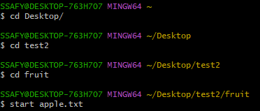
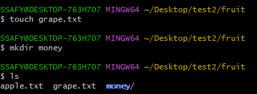
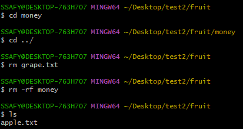
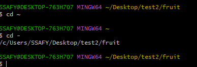

# 🥕 Preview
1. GUI와 CLI의 차이점을 정리했습니다.
2. CLI 명령어를 정리했습니다.

## 📖 GUI vs CLI

### 용어 정리
- GUI : Graphic User Interface
- CLI : Command Line Interface


### 차이점
- GUI : 그래프 같은 복잡한 분석을 보기에 편하다.
- CLI : 빠르다 => `commit` 명령어로 빠르게 커밋할 수 있다. 

### Window Os
- GUI : Windows Shell
- CLI : cmd(명령프롬프트 ), Power Shell

### Linux  Os
- GUI : GNOME
- CLI : Bash

### Git을 다룰 때 Interface
- GUI : Github Desktop, 소스트리
- ⭐ **CLI : Git Bash**

## 🤖 CLI 명령어
```
Desktop
    |_____ test
             |_____ fruit
                      |_____ apple.txt
                      |_____ grape.txt(⭕➡️✖️)
                      |_____ money(⭕➡️✖️)
```
### Desktop -> `apple.txt` 열기

- `~` : 홈 디렉토리
- `start` : 파일 열기

### 파일 `grape.txt`와 폴더 `money` 생성

- `touch` : 파일 생성
- `mkdir` : 폴더 생성

### 이동 및 파일 `grape.txt`와 폴더 `money` 삭제

- `..` : 상위 디렉토리
- `rm` : 파일 삭제
- `rm -rf` : 폴더 삭제
- `ls` : 현재 디렉토리 내부의 풀더와 파일 목록을 출력

### 이동 및 작성한 내용 삭제

- `cd -` : 뒤로가기
- `clear` : 작성한 모든 내용 삭제

## 💻 IDE
> IDE = Integrated Development Environment
> 
> 소프트웨어 개발에 필요한 다양한 도구들을 하나의 인터페이스에 통합한 소프트웨어이다.

1. Python
   - Pycharm
   - jupyter notebook
2. C/C++
   - Visual Studio
3. Java
   - IntelliJ

### 🔷 VScode
> VScode = Visual Studio Code
>
> Microsoft에서 개발한 **텍스트 에디터**이다. extension을 추가해서 마리 IDE처럼 쓴다.  
>
> [💡VScode 설치 바로가기](https://code.visualstudio.com/)


### Markdown
[dd](https://www.markdownguide.org/basic-syntax/)